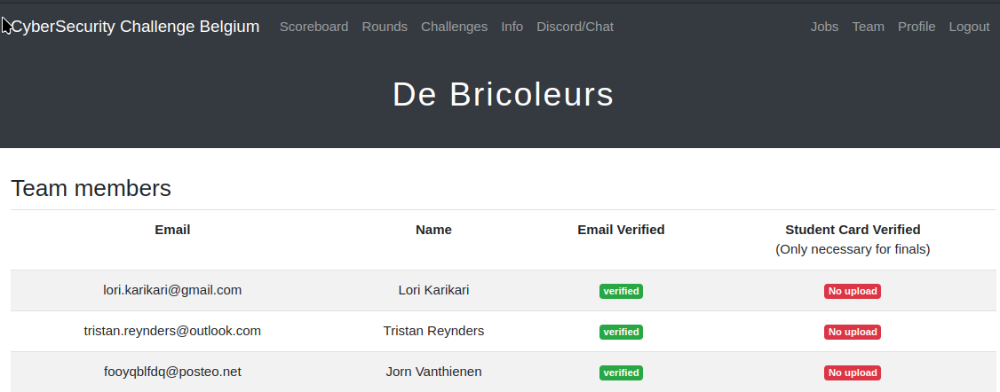
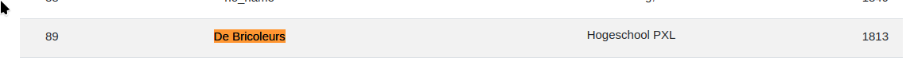

# Overzicht activiteiten

## Verplichte activiteiten, per domein

### Seminaries

#### PWC – Forensics

**Locatie activiteit:** Hogeschool PXL gebouw G G412a

**Datum en duur:** 21 maart 2023 – 3u 30min.

**Omschrijving:** Tijdens dit seminarie werd er een praktische aanpak om malware te gaan detecteren op een geïnfecteerde computer aangehaald, dit allemaal vanuit een incident response standpunt.

#### Refleqt – Security

**Locatie activiteit:** Hogeschool PXL gebouw G G412a

**Datum en duur:** 28 maart 2023 – 3u

**Omschrijving:** Dit was een seminarie waar de focus lag op insecure design van applicaties, hier werd de Juice Shop als voorbeeld aangehaald en werden er voorbeelden getoond van insecure design.

#### Gluo - Multi-Cloud

**Locatie activiteit:** Hogeschool PXL gebouw G G410

**Datum en duur:** 18 april 2023 – 3u

**Omschrijving:** Deze workshop had de focus op het multi-cloud gebeuren, hier werd een applicatie manueel opgezet op verschillende cloud providers met behulp van de laatste technologieën zoals Terraform.

#### Politie – RCCU

**Locatie activiteit:** Hogeschool PXL gebouw G G414

**Datum en duur:** 2 mei 2023 – 2u

**Omschrijving:** Dit seminarie ging over de taken bij de RCCU (Regionale Computer Crime Units) bij de federale politie en welke uitdagingen zij ondervinden. Hierbij kwam het verwerken van digitaal bewijsmateriaal en het bestrijden van cybercriminaliteit met de wetgeving aan bod.

#### Datasense – Battle of the Cloud Data Platforms

**Locatie activiteit:** Hogeschool PXL gebouw B B124

**Datum en duur:** 22 november 2023 – 2u

**Omschrijving:** Hier werd een vergelijking gemaakt tussen verschillende cloud data platformen. Snowflake was duidelijk een betere keuze, terwijl Synapse precies de minder goede keuze was.

#### Secwise – Cyber security operations in the real world

**Locatie activiteit:** Hogeschool PXL gebouw B B124

**Datum en duur:** 6 december 2023 – 4u

**Omschrijving:** Hier kwamen Security Operation Center diensten aanbod, zoals het monitoring bij blue teaming en bij red teaming de simulaties en preventie van aanvallen zoals phishing, rogue devices en insecure IoT.

#### A.C.A Group – From Hello World to Hello Work

**Locatie activiteit:** Hogeschool PXL gebouw B B124

**Datum en duur:** 13 december 2023 – 3u

**Omschrijving:** Tijdens deze workshop kregen we de basis van de Agile methodologie aangeleerd en werd er hands-on geprogrammeerd aan een Pizzeria webshop om bugs te verwijderen en nieuwe features te implementeren met een focus op de soft skills.

#### Politie – Intro in Digital Forensics

**Locatie activiteit:** Hogeschool PXL gebouw B B122

**Datum en duur:** 10 januari 2024 – 3u 30min.

**Omschrijving:** Dit seminarie ging over hoe je bewijsmateriaal en forensics uitvoert op verschillende toestellen met een focus op het gebruik van commandline tools in Linux.

### Innovatie

#### Innovatieroute

##### Fortinet – Unleash Your Cybersecurity Potential: From Zero Trust to SASE Mastery

**Locatie activiteit:** Hogeschool PXL gebouw G G412b

**Datum en duur:** 28 september 2023 – 7u

**Omschrijving:** Hier werden producten van Fortinet voorgesteld en hun gebruik in het werkveld. Verder was er ook een workshop om hands-on aan het werk te gaan met deze producten.

##### The Security Factory – Penatration Testing

**Locatie activiteit:** Hogeschool PXL gebouw G G412b

**Datum en duur:** 5 oktober 2023 – 7u

**Omschrijving:** Bij dit seminarie werden veel hacking voorbeelden uit het werkveld besproken en nader bekeken. In de namiddag was er een hands-on workshop om een website te hacken.

##### Gluo – DevSecOps

**Locatie activiteit:** Hogeschool PXL gebouw G G412b

**Datum en duur:** 12 oktober 2023 – 3u 30min.

**Omschrijving:**  In deze workshop werd het DevSecOps principe besproken en dankzij verschillende labs kwamen we er ook praktisch mee in aanraking door security tools in pipelines te integreren.

#### Hackathon – Cyber Security Challenge Belgium

**Locatie activiteit:** Hogeschool PXL gebouw B en de tweede dag thuis

**Datum en duur:**  8 maart 2024 – 9 maart 2024 – 32u

**Omschrijving:**  Tijdens deze hackathon kregen we als team van drie personen verschillende challenges op verscheidene domeinen om flags te zoeken. De challenges waren vrij afwisselend en boeiend. We hebben het niet gewonnen, maar we zijn op de 89ste plaats geëindigd van de 290 inschrijvingen.

**Bewijs:**

Teampagina:

Scoreboard:

