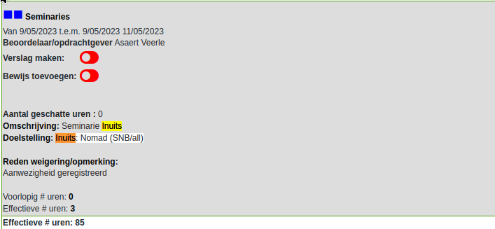
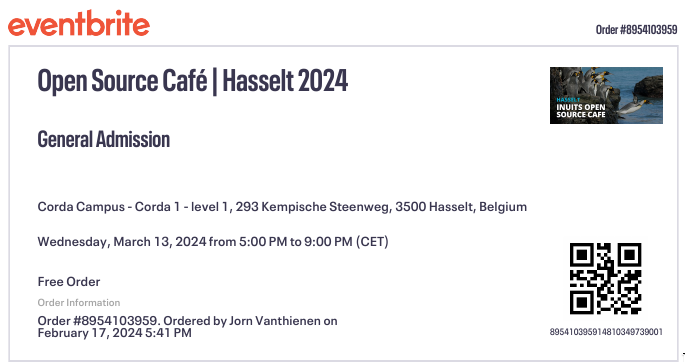
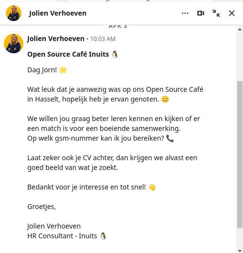

# Overzicht activiteiten

## Verplichte activiteiten, per domein

### Seminaries

#### PWC – Forensics

**Locatie activiteit:** Hogeschool PXL gebouw G G412a

**Datum en duur:** 21 maart 2023 – 3u 30min.

**Omschrijving:** Tijdens dit seminarie werd er een praktische aanpak om malware te gaan detecteren op een geïnfecteerde computer aangehaald, dit allemaal vanuit een incident response standpunt.

#### Refleqt – Security

**Locatie activiteit:** Hogeschool PXL gebouw G G412a

**Datum en duur:** 28 maart 2023 – 3u

**Omschrijving:** Dit was een seminarie waar de focus lag op insecure design van applicaties, hier werd de Juice Shop als voorbeeld aangehaald en werden er voorbeelden getoond van insecure design.

#### Gluo - Multi-Cloud

**Locatie activiteit:** Hogeschool PXL gebouw G G410

**Datum en duur:** 18 april 2023 – 3u

**Omschrijving:** Deze workshop had de focus op het multi-cloud gebeuren, hier werd een applicatie manueel opgezet op verschillende cloud providers met behulp van de laatste technologieën zoals Terraform.

#### Politie – RCCU

**Locatie activiteit:** Hogeschool PXL gebouw G G414

**Datum en duur:** 2 mei 2023 – 2u

**Omschrijving:** Dit seminarie ging over de taken bij de RCCU (Regionale Computer Crime Units) bij de federale politie en welke uitdagingen zij ondervinden. Hierbij kwam het verwerken van digitaal bewijsmateriaal en het bestrijden van cybercriminaliteit met de wetgeving aan bod.

#### Datasense – Battle of the Cloud Data Platforms

**Locatie activiteit:** Hogeschool PXL gebouw B B124

**Datum en duur:** 22 november 2023 – 2u

**Omschrijving:** Hier werd een vergelijking gemaakt tussen verschillende cloud data platformen. Snowflake was duidelijk een betere keuze, terwijl Synapse precies de minder goede keuze was.

#### Secwise – Cyber security operations in the real world

**Locatie activiteit:** Hogeschool PXL gebouw B B124

**Datum en duur:** 6 december 2023 – 4u

**Omschrijving:** Hier kwamen Security Operation Center diensten aanbod, zoals het monitoring bij blue teaming en bij red teaming de simulaties en preventie van aanvallen zoals phishing, rogue devices en insecure IoT.

#### A.C.A Group – From Hello World to Hello Work

**Locatie activiteit:** Hogeschool PXL gebouw B B124

**Datum en duur:** 13 december 2023 – 3u

**Omschrijving:** Tijdens deze workshop kregen we de basis van de Agile methodologie aangeleerd en werd er hands-on geprogrammeerd aan een Pizzeria webshop om bugs te verwijderen en nieuwe features te implementeren met een focus op de soft skills.

#### Politie – Intro in Digital Forensics

**Locatie activiteit:** Hogeschool PXL gebouw B B122

**Datum en duur:** 10 januari 2024 – 3u 30min.

**Omschrijving:** Dit seminarie ging over hoe je bewijsmateriaal en forensics uitvoert op verschillende toestellen met een focus op het gebruik van commandline tools in Linux.

### Innovatie

#### Innovatieroute

##### Fortinet – Unleash Your Cybersecurity Potential: From Zero Trust to SASE Mastery

**Locatie activiteit:** Hogeschool PXL gebouw G G412b

**Datum en duur:** 28 september 2023 – 7u

**Omschrijving:** Hier werden producten van Fortinet voorgesteld en hun gebruik in het werkveld. Verder was er ook een workshop om hands-on aan het werk te gaan met deze producten.

##### The Security Factory – Penatration Testing

**Locatie activiteit:** Hogeschool PXL gebouw G G412b

**Datum en duur:** 5 oktober 2023 – 7u

**Omschrijving:** Bij dit seminarie werden veel hacking voorbeelden uit het werkveld besproken en nader bekeken. In de namiddag was er een hands-on workshop om een website te hacken.

##### Gluo – DevSecOps

**Locatie activiteit:** Hogeschool PXL gebouw G G412b

**Datum en duur:** 12 oktober 2023 – 3u 30min.

**Omschrijving:**  In deze workshop werd het DevSecOps principe besproken en dankzij verschillende labs kwamen we er ook praktisch mee in aanraking door security tools in pipelines te integreren.

#### Hackathon – Cyber Security Challenge Belgium

**Locatie activiteit:** Hogeschool PXL gebouw B en de tweede dag thuis

**Datum en duur:**  8 maart 2024 – 9 maart 2024 – 32u

**Omschrijving:**  Tijdens deze hackathon kregen we als team van drie personen verschillende challenges op verscheidene domeinen om flags te zoeken. De challenges waren vrij afwisselend en boeiend. We hebben het niet gewonnen, maar we zijn op de 89ste plaats geëindigd van de 290 inschrijvingen.

**Bewijs:**

Teampagina:

Scoreboard:

### Persoonlijke Ontwikkeling

#### Projectweek

**Locatie activiteit:** Hogeschool PXL

**Datum en duur:**  13 februari 2024 – 17 februari 2024 – 27u

**Omschrijving maandag:**  Op de eerste dag van de projectweek kregen we uitleg over I-Talent, spreker gehoord over hoe je jezelf beter leert kennen en een workshop rond kernkwadranten samen met de eerste kennismaking met mijn projectgroep.

**Omschrijving dinsdag:**  Dinsdag heb ik een sessie gekregen over coaching en het reflectieverslag, ook werd er de Cyber Security Challenge besproken. Later op de dag kregen we een interessant seminarie van Ann Beckers over hoe netwerken werkt en de kracht van Linked-In.

**Omschrijving woensdag:**  In het midden van de projectweek kregen we uitleg over het Agile Scrum proces, gingen we hands-on aan de slag met Linked-In en was er een POP-sessie.

**Omschrijving Donderdag:**  Op donderdag kreeg ik uitleg over I-Talent en internationalisering en in de namiddag was het jobbeurs waar vele IT-bedrijven aanwezig waren en ik mijn eerste aanraking met de bedrijven had.

**Omschrijving Vrijdag:**  Op de laatste dag van de projectweek ben ik voor de eerste keer met mijn projectteam aan de slag gegaan binnen het Research Project.

#### POP-sessies

##### POP-sessie - Key To Improvement

**Locatie activiteit:** Hogeschool PXL gebouw B

**Datum en duur:** 15 februari 2023 – 2u

**Omschrijving:**  In deze POP-sessie tijdens de projectweek was er aandacht voor het feedbackproces en hoe men dit het beste in de praktijk toepast.

##### POP-sessie - POPping

**Locatie activiteit:** Hogeschool PXL gebouw B

**Datum en duur:** 28 februari 2023 – 2u

**Omschrijving:**  Tijdens deze POP-sessie lag het onderwerp rond het feedbackproces in teamverband en hoe je dit het beste doet en welke voordelen rond open communicatie dit oplevert.

##### POP-sessie - Brein aan het werk! Niet storen!

**Locatie activiteit:** Hogeschool PXL gebouw G G412b

**Datum en duur:** 28 februari 2023 – 2u

**Omschrijving:**  Deze sessie werd de nadruk gelegd op de digitale intoxicatie. Hier was een enquête aangekoppeld wat deze intoxicatie beoordeelde en ik scoorde relatief hoog terwijl ik dacht dat ik relatief laag zou zitten, dit was een interessant reflectiemoment.

##### POP-sessie – My Team and I

**Locatie activiteit:** Corda Campus iSpace

**Datum en duur:** 18 oktober 2023 – 2u

**Omschrijving:**  Deze sessie was mede gekoppeld aan het IT-Project en hoe je met verschillende persoonlijkheden in teamverband het beste kan samenwerken. Hier kwam bijvoorbeeld de piramide van Lencioni aan te pas en hoe dit kadert binnen het team.

## Extra activiteiten, per domein

### Seminaries

#### Inuits - Nomad

**Locatie activiteit:** Hogeschool PXL gebouw G G410

**Datum en duur:** 9 mei 2023 – 3u

**Omschrijving:** Dit was een interessant seminarie wat ging over een Kubernetes alternatief genaamd Nomad van Hashicorp. Hier kwamen de grote verschillen aan bod en in welk scenario je dit zou inzetten.

**Bewijs:**

#### Inuits - Open Source Café | Hasselt 2024

**Locatie activiteit:** Corda Campus Corda 1

**Datum en duur:** 13 maart 2024 – 4u

**Omschrijving:**  Tijdens dit event werden enkele presentaties gegeven over wat opensourcesoftware nu net is en hoe AI slim kan ingezet worden en hoe je modellen traint om deze voor specifieke gebruiksdoelen in te zetten. Verder was er ook een netwerkmoment om met verschillende professionals te praten.

**Bewijs:**

#### PXL – Hacking avond – picoCTF

