# Selectie activiteiten

## Innovatieroute – Gluo – DevSecOps

### Omschrijving

In deze workshop werd het DevSecOps principe besproken en dankzij verschillende labs kwamen we er ook praktisch mee in aanraking door security tools in pipelines te integreren. Met gevolg was het doel van deze sessie om meer bij te leren over het DevSecOps principe en mijn doelstelling was vooral om het begrip van Security binnen het DevOps verhaal beter te leren begrijpen en hoe dit valt te implementeren alsook hoe ik DevOps vs. DevSecOps moet plaatsen.

### Kern

Deze workshop was onderverdeeld in 5 labs die elk focuste op een bepaald aspect binnen DevSecOps. Doorheen deze labs ben ik in aanraking gekomen met verschillende technologieën zoals GitLab, Terraform, Docker, Kubernetes en Helm. Security was anderzijds geïmplementeerd door het gebruik van Trivy, Gatekeeper en Nikto. Op het einde van de labs had ik een simpele website gedeployed op een Kubernetes cluster.

Tijdens lab 1 moest ik met Terraform mijn eigen persoonlijke nodepool op een Kubernetes cluster zien gedeployed krijgen. Tijdens het deployment proces liep ik direct tegen mijn eerste error op. Deze error kwam door de validatie stage van de Terraform code in de pipeline. Bij nader onderzoek bleek dat er een typfout in de Terraform code was, namelijk het niet eerst vermelden van het resource type.

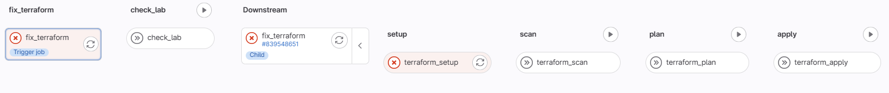

Verder doorheen lab 1 kwam ik mijn eerste security gerelateerde error tegen, deze error was gerelateerd met onveilige configuraties in de Terraform code, tijdens de Terraform Scan stage wordt de code geanalyseerd op onveilige instellingen en wordt hier een bepaalde weging aan gegeven. Naarmate deze zwaarder doorweegt zal de pipeline gestopt worden. De onveilige configuratie kwam uiteindelijk vanwege een Azure storage container wat op public stond en niet op private. Na de nodige aanpassing runde ik de pipeline opnieuw en de onveilige configuratie was weg en de pipeline finishte correct.

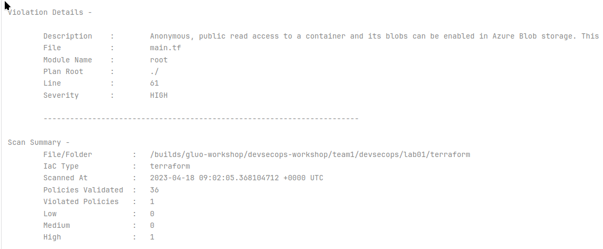

Nu ik mijn eigen persoonlijke nodepool werkende had, was het tijd voor naar lab 2 te gaan. Hier lag de focus rond Docker en meer bepaald het bouwen van een Docker image. Hier werd de te bouwen Docker image gecontroleerd door het programma Trivy, dit checkt de Dockerfile na op veiligheidsrisico’s en hier had ook direct de eerste fout mee te maken. Dankzij de handige waarschuwing werd de oplossing direct aangeboden, ik veranderde het ADD command met een COPY command in de Dockerfile en dit probleem was opgelost. Dit komt omdat het COPY command minder misbruikt kan worden dan het ADD command. Nu was ik in staat om mijn Docker image te bouwen en verder te gaan naar de volgende stap.

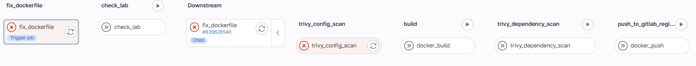

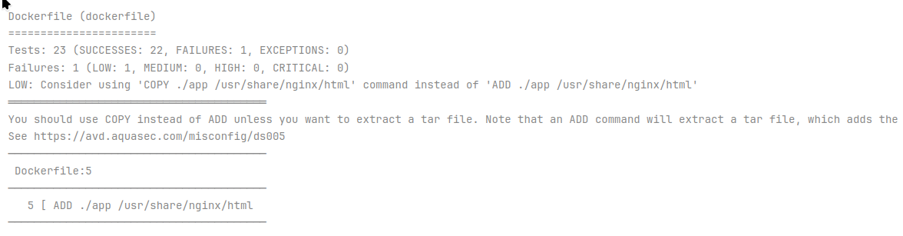

Dan als laatste stap scant Trivy ook de gebouwde Docker image op kwetsbaarheden en hier waren ook enkele onveiligheden in. Dit kwam omdat de gebruikte Docker image waarop verder gebouwd werd, een verouderde versie was. Door deze simpelweg naar een nieuwere versie te brengen waren de problemen opgelost.

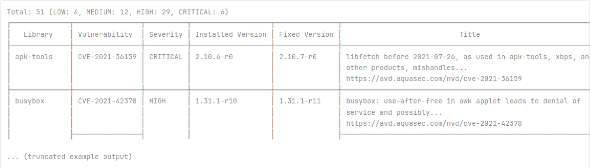

Nu dat ik de Docker image had kunnen bouwen en pushen naar de registry was het tijd om de applicatie met een Helm chart te deployen. Hier werd Trivy opnieuw gebruikt om de Helm chart te controleren en met gevolg waren hier ook twee vulnerabilities in te vinden die betrekking hadden tot de security context wat gedefinieerd werd. Door deze twee simpelweg te verwijderen in de Helm chart, gaf Trivy mij groen licht en kon ik de chart opslaan en klaarzetten voor gebruik.

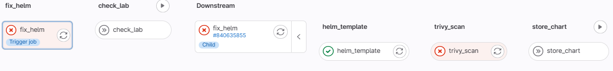

Lab 4 draaide helemaal rond de technologie Gatekeeper. Deze software controleert of de security requirements van de cluster worden nageleefd door deze Helm chart. Bij het runnen van de pipeline kreeg ik de een error van Gatekeer met betrekking tot een onjuist en onveilig UID. De UID was eerst gespecificeerd als 0, maar er is een policy wat voorkomt dat het 0 mag zijn. Na het aanpassen van het UID kon ik de Helm chart deployen.

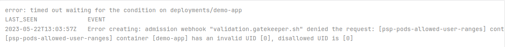

Tijdens het laatste lab lag de focus op web security. Hier kwam ik in aanraking met Nikto, dit is een web security scanner. Bij het runnen van de pipeline kreeg ik van Nikto verschillende boodschappen, een onveilige HTTP PUT methode die actief is en een /admin.html pagina die beschikbaar is. De onveilige HTTP PUT en /admin.html pagina heb ik niet aangepast maar ik heb er voor gezorgd dat deze niet beschikbaar zijn van buiten uit. Na het runnen van de pipeline kreeg ik groen licht en had ik de workshop succesvol voltooid.

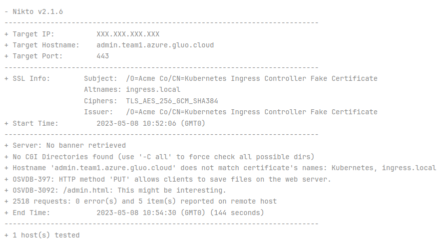

### Reflectieopdracht

De reden waarom ik deze workshop gekozen heb ter bespreking is omdat deze erg kort aanleunt tegen mijn DevOps interesse. Deze workshop voegde het security verhaal toe aan het DevOps verhaal via een hands-on workshop ervaring. Deze workshop had verder ook erg veel aanrakingspunten met mijn gekozen afstudeerrichting (Systemen en netwerkbeheer) zoals de gebruik te technologieën en het DevOps principe.

In het begin was ik wel wat overweldigd van de complexiteit van de opstelling en dacht ik dat ik het niet goed zou kunnen volgen. Maar door alle code goed te bestuderen kreeg ik een duidelijk beeld van de opstelling. Hierdoor heb ik dus vooral geleerd dat even een stap terugnemen en bestuderen heeft duidelijk geholpen en dit is beter dan er direct proberen mee aan de slag te gaan.

Ik vond de confrontatie met security erg interessant, zeker omdat men dit demonstreerde door middel van de hands-on ervaring met een real-world applicatie. Hierdoor merkte ik dat ik weinig tot niet heb stilgestaan bij veel security aspecten van je deployment. Anderzijds merkte ik wel dat ik erg sterk was in de technische kennis om met deze technologieën te werken ondanks dat er vele nieuw voor mij waren en ik vrijwel alleen in aanmerking was gekomen met Docker en Kubernetes.

Ook heb ik het inzicht gekregen dat deze checks in de pipeline niet zozeer een irritatie zijn, maar juist erg veilig zijn en dat deze de pipeline direct stoppen en voorkomen dat er onveilige eindresultaten gemaakt worden. Ik heb duidelijk de interesse hierin meegenomen om met deze tools zelf aan de slag te gaan en deze vanaf nu ook te implementeren bij toekomstig werk

## FOSDEM – Europese meeting

### Omschrijving

Op zaterdag 3 februari ben ik samen met twee medestudenten naar de internationale FOSDEM conferentie geweest in de ULB Solbosch Campus te Brussel. Tijdens dit internationaal event kwam ik in aanraking met professionals van over de hele wereld, ik heb interessante rooms gevolgd en gepraat met verschillende mensen en organisaties die aanwezig waren. De doelstelling van FOSDEM is om kennis internationaal te delen en dat vrije sprekers in alle vrijheid interessante topics kunnen aanhalen wat zij belangrijk vinden. Mijn grootste doelstelling was om deze ervaring te kunnen meemaken en nieuwe interessante visies te ontdekken.

### Kern

Deze geweldige dag startte in een goed uitgedachte treinrit die startte in Hasselt waar mijn medestudenten opstapte. Ik stapte uiteindelijk op in Tienen en zo hadden we samen nog een goede treinreis tot Brussel tegemoet. Tijdens deze treinrit hadden we de kans om samen een planning op te stellen van de dag en welke rooms we dachten te gaan bijwonen. Bij aankomst hadden we de ULB campus vrij vlot gevonden.

Om 9u30 in de voormiddag werd de start van FOSDEM afgeroepen in een gezamenlijke aula die overvol zat. Hier werd de basis van FOSDEM uitgelegd, wat er te verwachten valt en praktische afspraken. Hier heb ik ook direct de hint ontvangen dat de volgende FOSDEM, de 25ste zal zijn en dan zijn we er zeker weer bij!

De eerste room wat ik had bijgewoond noemde “Take Your FOSS Project From Surviving To Thriving” en ging over hoe het Thunderbird project van bijna uitgestorven tot terug volledig relevant. Hier werd vooral het aspect van donaties benadrukt en hoe donaties werken binnen opensourcesoftware. Verder waren de donatiecijfers ook baanbrekend, 326% toename in donaties op één jaar tijd.

Een volgende room waar ik bij zat was in de JavaScript room. Deze talk ging over het inefficiënt programmeren van JavaScript web applicaties. Het startte met de memes over Google Chrome en dat het al het RAM geheugen in je computer nodig heeft, maar als snel werd de ernst van de situatie duidelijk. De spreker liet zien hoe zijn applicatie gewoonweg niet meer kon werken vanwege RAM limitaties en hoe hij dit moest aanpakken om zijn applicatie toch succesvol te laten werken in een webbrowser. Hij haalde hier de tools in aan die hij gebruikte om de bottlenecks te vinden in zijn code zoals de Chrome Memory Profiler.

Overvolle JavaScript room waar de talk over RAM geheugen verbruik werd gegeven:

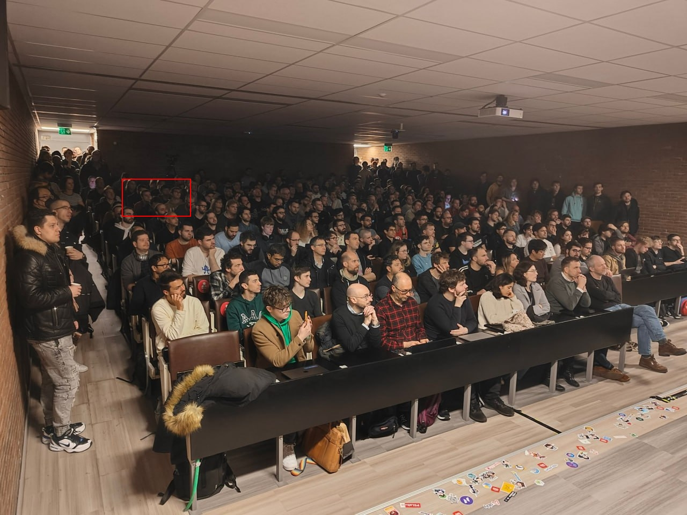

De laatste room voor de middagpauze ging over Kubernetes Operators. Hierin werd het concept van een Kubernetes Operator aangehaald, hoe dit werkt en hoe dit geïmplementeerd wordt. Ook werd er een praktische use-case gedemonstreerd over hoe Kubernetes Operators de applicatie beter doen schalen, efficiënter maken en betrouwbaarder.

Als volgende room had ik een room gekozen die aanleunt met mijn achtergrond in de automotive sector. Hierin werd het concept besproken om vele toepassingen en units binnen een automobiel te abstraheren. Hun doel was om een abstracte automotive software stack te bouwen dat op zijn beurt het fundament is voor toekomstige ontwikkeling en het unaniemer toepassen van software binnen automotive.

Bij de devrooms was onze keuze snel gemaakt om ons binnen de Go devroom te bevinden, hier was een talk bezig over hoe je snel en vlot in Go een grafische applicatie kan bouwen met het gebruik van de juiste tools. Hier werd het Fyne en Fysion aangehaald. Hier was te zien hoe je vrij snel een rekenmachine applicatie gebouwd krijgt in Go. Ik ben zelf geen goede Go programmeur maar de waarde in dit soort technologieën is groot.

Als een kleine pauze van de rooms zijn we langs de de hallway track geweest waar grote namen zoals Mozilla, Nextcloud, PostgreSQL, Jenkins enzovoort stonden. Hier hebben we enkele conversaties gehad en bij Jenkins was ik erg onder de indruk omdat ze hun toch wel vrij oude software aan het moderniseren zijn om met de laatste nieuwe technologieën zoals Kubernetes te kunnen werken, m.a.w. ze zorgen dat ze niet irrelevant worden. Verder was er ook Coreboot te zien, dit is één van de projecten die ik volg en ik was blij om te horen dat ze sinds heel kort een nieuwer Intel platform ondersteunen. Ook dit project blijft zichzelf relevant houden.

Ondertussen bij het wisselen van rooms kwamen we deze leuke PostgreSQL mascotte tegen en het kon ons niet weerstaan om toch een foto te maken:

Naarmate de dag eindigde hadden we nog een laatste room die ik puur uit de interessante naam gekozen had. Deze talk ging over een persoon wat al zijn elektriciteitsverbruik monitorde en verbeterde met het gebruik van de Mozilla Firefox Profiler, wat eigenlijk een web performance analyse tool is. Zo kon hij het verbruik van verscheidene elektrische verbruikers in zijn huis in kaart brengen en dit optimaliseren.

Om de dag af te sluiten zijn we nog iets gaan drinken samen en hebben we onze treinrit terug ingezet.

### Reflectieopdracht

Dit event was één van de hoogtepunten binnen mijn opleiding, omdat het zo kort aansloot met mijn interesses en omdat er zoveel interessante rooms gegeven werden. Dit maakte het linken van wat ik geleerd heb in de opleiding aan het werkveld veel gemakkelijker om zo overprikkelt te worden met al deze dingen. Dit is de hoofdreden waarom ik dit gekozen heb om uitbundig te bespreken.

Het idee om naar de FOSDEM conferentie te gaan was al een tijdje aan het spelen in mijn hoofd. Uiteindelijk had ik besloten om dit tijdens mijn laatste jaar van de opleiding te doen. Hiermee ben ik blij dat ik de knoop had doorgehakt en met gevolg met medestudenten concrete plannen had gemaakt en deze gerealiseerd had. Hierbij heb ik vooral geleerd dat je je moet omringen met de juiste mensen dat dezelfde interesses delen als jezelf.

Ik merkte ook dat ik mijn taal en soft skills moest benutten tijdens dit event omdat het zo internationaal was. Hierin had ik verwacht dat ikzelf zwak zou zijn, maar in de praktijk is me opgevallen dat dit best goed ging. Dit was een boost in mijn zelfzekerheid. Hierdoor heb ik interessante inzichten en visies tijdens de hallway track gekregen door het praten met verschillende mensen van de projecten.

Ook was er bij de start van FOSDEM aangehaald dat er meer als 50% kans bestaat dat je ziek wordt na deze conferentie. Dit vond ik in eerste instantie schokkend, maar bij nader inzien lijkt me dit logisch aangezien dit zo internationaal is en er mensen van over de hele wereld komen. Hier had ik misschien beter over moeten nadenken en meer stil hebben moeten staan bij de risico’s.

Ik vond dit een heel leerrijke ervaring, ook op gebieden wat ik niet verwacht had, zoals hoe belangrijk donaties bij opensourcesoftware is, maar ook op technisch vlak zoals het inefficiënt programmeren tot het creatief hergebruik van software voor een andere doelstelling.

Tot slot wil ik de aansluiting met de opleiding nog even aanraken omdat dit duidelijk uitgesproken te voelen was. Tijdens de talk van Kubernetes Operators kon ik heel goed volgen en had ik het gevoel dat ik al veel kende en dat heb ik meegekregen vanuit de opleiding. Dit was een leuk gevoel om mee te zijn en goed te kunnen volgen. Verder heb ik het inzicht gekregen dat de automotive sector en de IT-sector vrij kort tegen elkaar aanleunen.

## Hackathon – Cyber Security Challenge Belgium

### Omschrijving

Als Hackathon heb ik meegedaan aan de Cyber Security Challenge van België. Samen met mijn medestudenten zijn we op zoek gegaan op verscheidene domeinen om flags te zoeken. We hebben het niet gewonnen, maar we zijn op de 89ste plaats geëindigd van de 290 inschrijvingen.

### Kern

De Cyber Security Challenge van België startte op 8 maart 2024 om 10u in de voormiddag. Ons team had de afspraak gemaakt om op de Corda Campus in de iSpace van de Hogeschool PXL samen te komen om van daaruit te werken. Dit was een kleine miscalculatie omdat de iSpace blijkbaar heel die dag volgeboekt was en als gevolg was er geen plaats meer voor ons. We hebben er even kunnen werken, maar al snel moesten we de plaats afstaan voor mensen die de plaats geboekt hadden. Op die moment konden we niet werken voor de Challenge, maar door even goed te overleggen met het team, kwamen we al snel tot de conclusie om de Challenge verder te zetten op de Hogeschool campus. Als gevolg hebben we ons verplaatst en hadden we plaats gevonden in gebouw B.

Nu we uiteindelijk goed geïnstalleerd waren, konden we ons focussen op de challenge. Vanwege het voorval hebben we wat tijd verloren, maar het had niet zo een grote impact uiteindelijk.

We hebben eerst samen de volledige challenge overlopen en afspraken gemaakt over wie zich op wat gaat focussen en verder ook enkele praktische afspraken. We hebben het tactisch aangepakt door elke persoon zijn talent te gebruiken. Zo was ik bijvoorbeeld goed in infrastructuur en systemen, dus had ik mij challenges zoals DNS en reverse engineering op mij genomen. Tristan aan de andere kant is goed in edge case situaties, Tristan was erg goed in creatief nadenken om tot de oplossing te komen. Zo had hij zich vooral gefocust op de forensics. Lori haar talent lag juist binnen het programmeren, web en mobile. Hierdoor vormden we een sterk team.

Eén van mijn eerste challenges omvatte het zoeken van een flag in een keygen applicaties. Dit was een applicatie wat enkel op Windows werkte en je kon klikken tot 10, maar op de 11de keer zou je normaal de flag vastkrijgen, maar dat was geblokkeerd. Na een tijdje zoeken kwam ik er achter dat je .NET code kan decompilen. Toen werd het mij al vrij duidelijk hoe deze applicatie werkte.

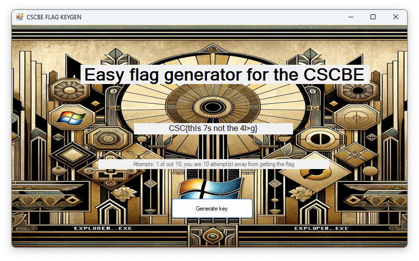

Ik heb de applicatie ontleed en de belangrijke code voor de flag gekopieerd naar een eigen console applicatie, hier importeer ik de juiste dll file en gebruik ik hun EncryptDecrypt functie. Dan vorm ik de uitkomst om en print ik deze naar de console.

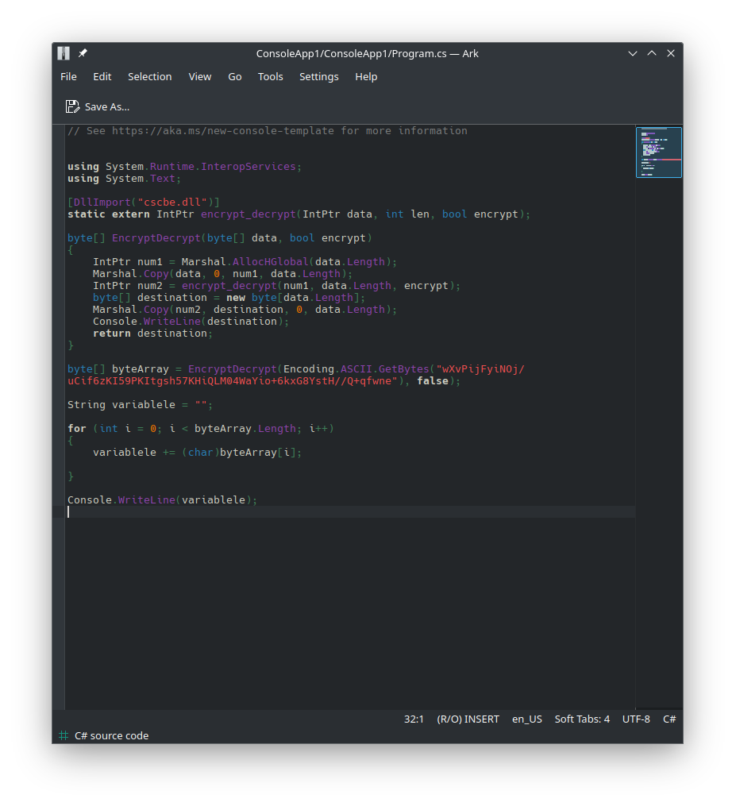

Na het uitprinten van de flag was dit de juiste en had ik de challenge.

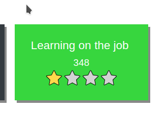

Nadat we een hele dag op de campus aan het werk waren geweest voor de challenge hadden we besloten om naar huis te vertrekken en de dag er op terug verder te doen. Sommige teams deden de nacht door. Ik wou dat in eerste instantie wel doen, maar we zijn toch overeengekomen dat we vanuit gezondheidsredenen dit niet doen.

De dag erna in de voormiddag waren we weer actief bezig en zagen we dat er ook nieuwe challenges waren bijgekomen.

Naast de challenges die ik had uitgewerkt, heb ik bijvoorbeeld ook samengewerkt met Tristan om een hele specifieke challenge op te lossen. Deze noemde “Message Crossing”. Hierbij werd enkel een versleutelde tekst gegeven met als hint “Tom Nook has a message for you! What does it mean?”. Dankzij Tristan zijn creatief brein wisten we al snel dat het iets te maken had met het spelletje Animal Crossing waar Tom Nook een character in speelt. Na een hele tijd zoeken kwam ik uit dat het spel cheatcodes heeft en die leken heel erg op de versleutelde tekst.

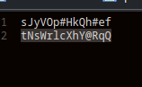

Dit waren dus codes die je in-game kon gebruiken:

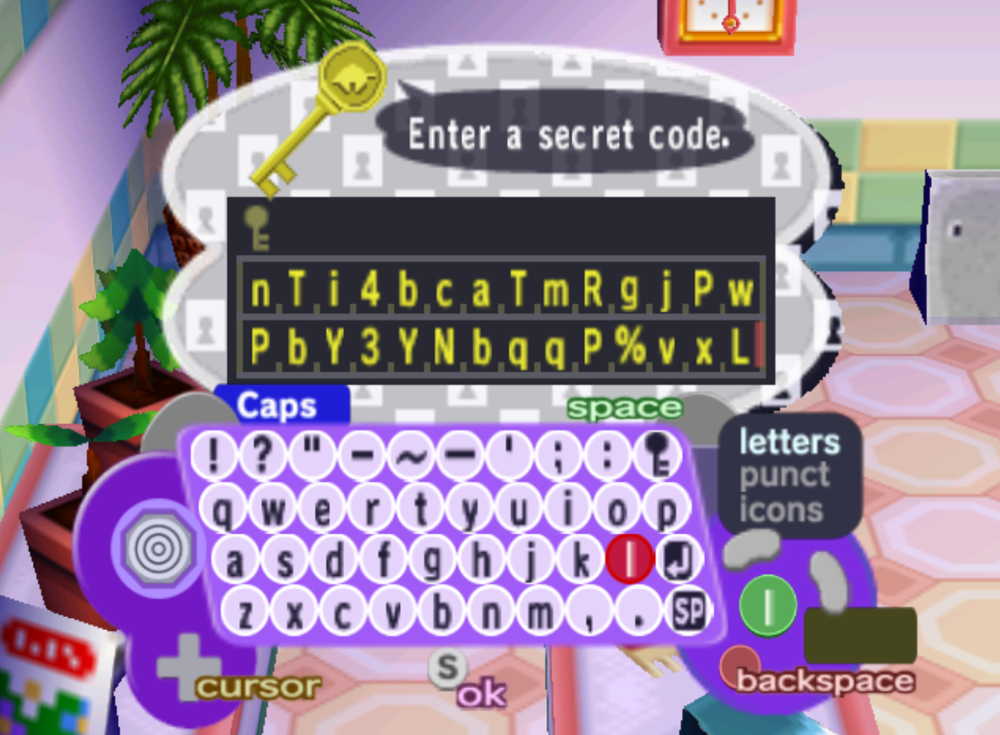

Als gevolg ben ik beginnen zoeken hoe de cheatcodes juist werken en na niet zo lange tijd kwam ik uit op een decoder voor chatcodes van Animal Crossing.

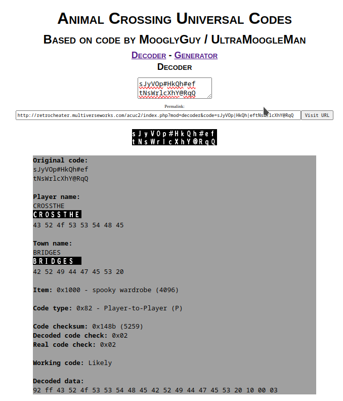

Bij ingave van de versleutelde tekst hier, werd duidelijk dat “CROSSTHEBRIDGES” de flag was. Ik vond dit een super leuke challenge om dat zo uniek was en het was gelinkt met een spel.

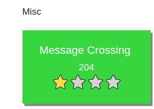

Naar het einde van de Cyber Security Challenge hadden we veel challenges opgelost, maar bleven er enkele open waar we op vastzaten. De laatste 3u was erg vermoeiend omdat onze motivatie ook was weggezakt. Ik was gestopt met de focus op mijn challenge en had me aangesloten bij Tristan die aan het zoeken was op de “Japanese Archeolinguistics” waar je uit een audiofragment de flag moet vastkrijgen. Maar deze hebben ge spijtig genoeg niet kunnen vinden.

Uiteindelijk in het laatste uur begonnen we stilaan te stoppen en hadden we ons verlies aanvaard, maar in positieve zin. We hebben dat uur samen zitten reflecteren op hoe we het gedaan hadden en we waren tevreden met onze plaats op het scoreboard. Ook was het leuk om te weten dat Team Cactus op de 72ste plaats geëindigd is met 2277 punten. Dit team waren medestudenten van onze klas.

### Reflectieopdracht

Als ik terugkijk naar de periode voor de Challenge, was ik vrij onzeker of ik hier wel aan wou meedoen omdat ik niet geloofde dat ik goed genoeg was om hier aan mee te doen. Mijn medestudent Tristan is erg geïnteresseerd in cyber security en had me hier in mee getrokken. Als ik hier met gevolg achteraf op terugkijk zijn we best goed geëindigd op het scoreboard en ben ik wel echt tevreden van onze teamprestatie. Ik leer vooral dat ik mezelf soms niet zo moet onderschatten en dat als je niet de beste kan zijn, het nog steeds de moeite is om een leuk moment mee te maken. Hier ga ik proberen mezelf meer van bewust te maken door aan dit moment terug te denken.

Ik had ook in het begin een frustratie met de challenge vanwege de slecht gekozen locatie op de Corda Campus en dat we tijd aan het verliezen waren in het begin van de dag. Ik was erg blij in deze situatie dat we als team een vlotte en slimme oplossing hebben kunnen bedenken en deze snel hebben toegepast. Dit zijn situaties waarin teamwork belangrijk is en dat je samen duidelijke afspraken maakt. Communicatie en wat je durven zeggen wat je voelt zijn hier heel belangrijk in.

In het begin van de challenge hadden we het vrij tactisch opgedeeld van wie welke challenges maakt. Dit was tijdens de eerste dag een heel goed idee omdat we zo elkaars talenten combineerde. Maar naar de 2de dag toe begonnen we ons gewoon bezig te houden met de leuke challenges i.p.v. het tactisch te spelen. Deze dynamische verandering in het groepsgebeuren vond ik eerst moeilijk omdat ik prestatiegericht aan het denken was. Maar uiteindelijk vond ik deze aanpak ook juist leuk omdat we er zo een leuk einde aan hebben kunnen geven. Hierin leer ik vooral dat een bepaalde aanpak daarom niet de beste is. Verwachtingen binnen het teamwork veranderen dynamisch mee met de omstandigheden en daarom is een bepaalde vaste aanpak niet de beste en moet deze ook dynamisch meebewegen.

Om verder te gaan op mijn aanpak van prestatie, wou ik initieel ook de nacht doordoen, maar hier hebben we in team voor gekozen om het niet te doen vanwege de gezondheid. Hier heeft het team mij afgeremd waar ik achteraf gezien dankbaar voor ben, omdat dit niet nodig was om hier een leuk moment van te hebben gemaakt.

Als laatste wil ik graag ook nog het laatste moment tijdens de challenge aanhalen waar we samen hebben zitten praten en reflecteren op de challenge. Hier werd in besproken hoe ieder van ons het ervaren had en wat leuke en minder leuke momenten waren. Ik vond apart van de inhoud van dit gesprek, het moment gewoon leuk omdat je zo elkaars ervaring hoort en aanvoelt. Dit vond ik een heel waardevol moment en heeft me ook het gevoel van voldoening gegeven.